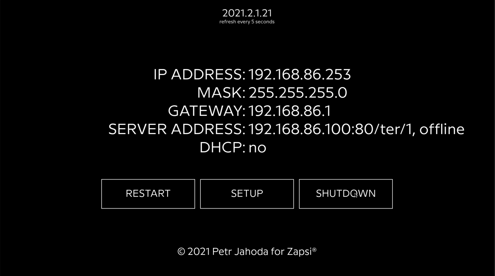

# Terminal Local WebService Rpi

* [1. Prepare Raspberry Pi](#1-prepare-raspberry-pi)
* [2. Install Chromium in kiosk mode](#2-install-chromium-in-kiosk-mode)
* [3. Copy program data to Raspberry](#3-copy-program-data-to-raspberry)
* [4. Make program run as service](#4-make-program-run-as-service)
* [5. Clean booting screen and information](#5-clean-booting-screen-and-information)
* [6. Make Raspberry Pi read-only](#6-make-raspberry-pi-read-only)
* [7. Passwords](#7-passwords)
* [8. Remote administration](#8-remote-administration)




## 1. Prepare Raspberry Pi
* install raspbian lite using Raspberry Pi Imager from [official site](https://www.raspberrypi.org/software/)
* update and upgrade using `sudo apt-get update && sudo apt-get upgrade`
* using `sudo raspi-config`
  * enable console autologin
  * enable ssh
  * enable overscan (or disable underscan)
* install maim using `sudo apt-get install maim`
* install network manager using `sudo apt-get install network-manager`
* enable network manager as service using `sudo systemctl enable NetworkManager`
* start network manager as service using `sudo systemctl start NetworkManager`
* disable old dhcp service using `sudo systemctl mask dhcpcd`  
* install ufw using `sudo apt-get install ufw`
* enable port 9999 using `sudo ufw allow 9999`
* reboot using `sudo reboot now`

## 2. Install Chromium in kiosk mode
* install prerequisites using `sudo apt-get install --no-install-recommends xserver-xorg x11-xserver-utils xinit openbox`
* install chromium using `sudo apt-get install --no-install-recommends chromium-browser`
* edit autostart file using `sudo nano /etc/xdg/openbox/autostart`, insert those lines:
```
# Disable any form of screen saver / screen blanking / power management
xset s off
xset s noblank
xset -dpms

# Allow quitting the X server with CTRL-ATL-Backspace
setxkbmap -option terminate:ctrl_alt_bksp

# Start Chromium in kiosk mode
sed -i 's/"exited_cleanly":false/"exited_cleanly":true/' ~/.config/chromium/'Local State'
sed -i 's/"exited_cleanly":false/"exited_cleanly":true/; s/"exit_type":"[^"]\+"/"exit_type":"Normal"/' ~/.config/chromium/Default/Preferences
chromium-browser temporary-unexpire-flags-m80 --start-fullscreen --kiosk --incognito --noerrdialogs --disable-translate --no-first-run --fast --fast-start --disable-infobars --disable-features=TranslateUI --disk-cache-dir=/dev/null  --password-store=basic --disable-pinch --overscroll-history-navigation=disabled --disable-features=TouchpadOverscrollHistoryNavigation 'http://localhost:9999'
```
* make everything start on boot using `sudo nano .bash_profile` , insert this line:
```
[[ -z $DISPLAY && $XDG_VTNR -eq 1 ]] && startx -- -nocursor
```
>TIP: by pressing `Ctrl-Alt-Backspace` you can kill chromium and get into command line

## 3. Copy program data to Raspberry
* copy files from terminal_local_webservice/rpi directory to raspberry pi /home/pi
  * rpi_linux into /home/pi
  * /config/* into /home/pi/*
  * /html/* into /home/pi/*
  * /css/* into /home/pi/*
  * /js/* into /home/pi/*
  * /font/* into /home/font/*
    
> EXAMPLE: copying rpi program file using scp: `scp rpi/rpi_linux pi@<ipaddress>:/home/pi`> 

> EXAMPLE: copying all directories using scp: `scp -r config html css js font pi@<ipaddress>:/home/pi`
  
## 4. Make program run as service
* create new file using `sudo nano /lib/systemd/system/zapsi.service`, insert those lines:
```
[Unit]
Description=Zapsi Service
ConditionPathExists=/home/pi/rpi_linux
After=network.target
[Service]
Type=simple
User=root
Group=root
LimitNOFILE=1024
Restart=on-failure
RestartSec=10
startLimitIntervalSec=60
WorkingDirectory=/home/pi
ExecStart=/home/pi/rpi_linux
PermissionsStartOnly=true
StandardOutput=syslog
StandardError=syslog
SyslogIdentifier=zapsi_service
[Install]
WantedBy=multi-user.target
```
* make sure that file is executable using `sudo chmod 755 /lib/systemd/system/zapsi.service`
* make service autostart using `sudo systemctl enable zapsi.service`
* start the service now using  `sudo systemctl start zapsi.service`
>TIP: search logs using `journalctl -f -u zapsi.service`

## 5. Clean booting screen and information
* disable starting rainbow using `sudo nano /boot/config.txt`
    * add line `disable_splash=1`
* disable booting information using `sudo nano /boot/cmdline.txt`
    * add at the end of first line `silent quiet splash loglevel=0 logo.nologo vt.global_cursor_default=0`
    * replace `console=tty1` with `console=tty3`
* disable booting autologin terminal information
    * run `touch ~/.hushlogin`
    * run `sudo nano /etc/systemd/system/getty@tty1.service.d/autologin.conf`
      * replace line `ExecStart=-/sbin/agetty --autologin pi --noclear %I xterm-256color` with `ExecStart=-/sbin/agetty --skip-login --noclear --noissue --login-options "-f pi" %I $TERM`

## 6. Make Raspberry Pi read-only
* remove swap
```
sudo dphys-swapfile swapoff
sudo dphys-swapfile uninstall
sudo update-rc.d dphys-swapfile remove
```
* update and upgrade everything
```
sudo apt-get update
sudo apt-get dist-upgrade
sudo apt-get upgrade
sudo BRANCH=next rpi-update
```
* reboot using `sudo reboot now`
* create initramfs using `sudo mkinitramfs -o /boot/initrd`
* add script using `sudo curl https://gist.githubusercontent.com/paul-ridgway/d39cbb30530442dca416734c3ee70162/raw/c490df8be1976dd062a8b5f429ef42ed1b393ecb/ro-root.sh -o /bin/ro-root.sh`
* make the script executable using `sudo chmod +x /bin/ro-root.sh`
* add those lines at the end of config file using `sudo nano /boot/config.txt`
```
initramfs initrd followkernel
ramfsfile=initrd
ramfsaddr=-1
```
* add this text at the end of cmdline file using `sudo nano /boot/cmdline.txt`
```
init=/bin/ro-root.sh
```
* reboot using `sudo reboot now`
> TIP: root partition is mounted as `/ro`, you can make it writable using `sudo mount -o remount,rw /ro`, create a permanent file using `touch /ro/home/pi/test` and make it back read-only using `sudo mount -o remount,ro /ro`, the file will persist after boot 

## 7. Passwords
* user `pi` with password `3600`
* setup password is `3600`

## 8. Remote administration
* screenshot at `http://<ipaddress>:9999/screenshot`
* remote restart using javascript:
```
let data = {
  password: "3600"
};
fetch("/restart", {
  method: "POST",
  body: JSON.stringify(data)
}).then((result) => {
  console.log(result)
}).catch(() => {
});
```
* remote shutdown using javascript:
```
let data = {
  password: "3600"
};
fetch("/shutdown", {
  method: "POST",
  body: JSON.stringify(data)
}).then((result) => {
  console.log(result)
}).catch(() => {
});
```
* set dhcp using javascript:
```
let data = {
  password: "3600",
  server: server.value,         // server web, example: 192.168.86.100:80/terminal/1
};
fetch("/dhcp", {
  method: "POST",
  body: JSON.stringify(data)
}).then((result) => {
  console.log(result)
}).catch(() => {
});
```

* set static using javascript:
```
let data = {
  password: "3600",     
  ipaddress: ipaddress.value,   // ip address, example: 192.168.86.128
  mask: mask.value,             // mask, example: 255.255.255.0
  gateway: gateway.value,       // gateway, example: 192.168.86.1
  server: server.value,         // server web, example: 192.168.86.100:80/terminal/1
};
  fetch("/static", {
  method: "POST",
  body: JSON.stringify(data)
}).then((result) => {
  console.log(result)
}).catch(() => {
});
```

© 2021 Petr Jahoda
